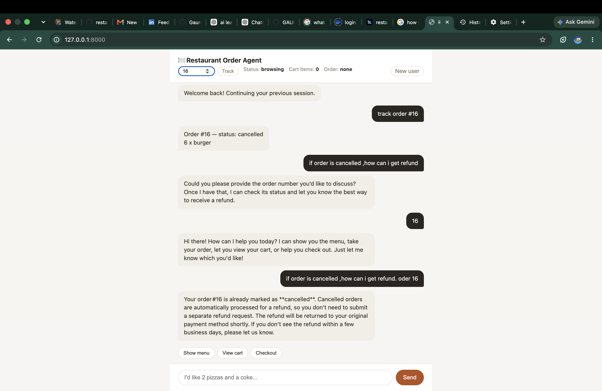
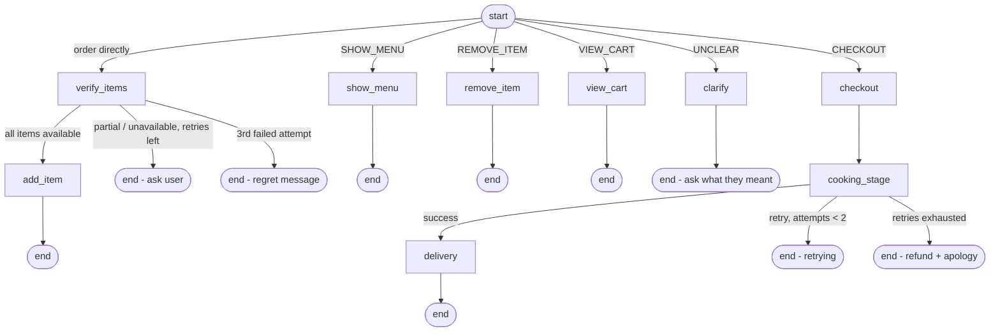

# restaurant-order-agent

A LangGraph-based restaurant ordering agent, exposed as a FastAPI service.

## Demo



*Screenshot of the browser chat UI (`static/index.html`) mid-conversation — showing the menu, cart, and status bar.*

> Drop a screenshot of the running UI at the repo root as `demo.png` for it to render above. See [Run](#run) for how to start the app and grab one.

## Structure

- `agent.py` — the LangGraph agent: intent routing, item verification, cart, checkout, cooking, delivery. Core logic only, no HTTP.
- `service.py` — thin FastAPI service layer that wraps `agent.py` and exposes it over HTTP as a single stateful `/chat` endpoint.
- `helpers/constants.py` — static data (currently the `MENU`).
- `helpers/llm.py` — LLM client setup/connectivity (the `ChatGroq` instance), imported by `agent.py`.
- `helpers/models.py` — all Pydantic/data models (`RequestedItem`, `RequestedItems`, `Cart`, `Order`, `State`, `Status`), imported by `agent.py`.
- `static/index.html` — a minimal browser chat UI for `/chat` (plain HTML/JS, no build step).
- `demo.png` — screenshot of the UI, shown at the top of this README (not committed by default — add your own).
- `.env.example` — copy to `.env` and fill in your `GROQ_API_KEY` (and optionally `REDIS_URL`).

## Setup

Requires a running Redis server (session state is stored there — see [Session persistence](#session-persistence)):

```bash
brew install redis        # macOS; see redis.io for other platforms
brew services start redis
```

Then the app itself:

```bash
python3 -m venv .venv
source .venv/bin/activate
pip install -r requirements.txt
cp .env.example .env   # then edit .env with your real GROQ_API_KEY
```

## Run

```bash
uvicorn service:app --reload
```

Service runs at http://localhost:8000:

- **http://localhost:8000/** — browser chat UI (fastest way to try the agent)
- **http://localhost:8000/docs** — interactive API docs (Swagger)

## Conversation flow

The customer can either browse the menu first or order directly — both paths converge on the same verification step before anything is added to the cart.



Key rules baked into the graph:

- **Verification, not blind add**: an order-style message always goes through `verify_items` first. Items are only added to the cart once stock is confirmed.
- **3-strike limit**: `query_count` tracks failed verification attempts. On the 3rd unresolved attempt the agent sends a regret message and stops (`status = "regretted"`).
- **Cart merge, not replace**: `add_item` sums quantities into an existing cart line for the same item instead of overwriting it.
- **Cooking retries**: `cooking_stage` simulates kitchen failures, retries up to 2 times (`cook_retry_count`), and if still failing apologizes and flags a refund instead of retrying forever.
- **Stateful turns, server-side**: the graph is not one-shot. `status`, `query_count`, `cook_retry_count`, `cart`, and `order` all live in a Redis-backed session, keyed by `session_id`. The client never sees or sends these — it only ever sends a `message` (and the `session_id` after the first call).
- **Ask, don't guess**: `route_intent` doesn't silently force ambiguous input into one of the known actions. See [Routing: classifier vs. agentic](#routing-classifier-vs-agentic) below.

## Routing: classifier vs. agentic

`route_intent` already used the LLM to classify each message — it was never a fixed keyword matcher. But the original version forced every message into one of 5 labels and, when the model's answer didn't match any of them, silently defaulted to `SHOW_MENU`. That's a classifier with a blind guess bolted on: it never admits uncertainty, it just picks something and hopes.

The current version adds a 6th label, `UNCLEAR`, with explicit instructions not to force-fit ambiguous input into a real action. When the model reaches for `UNCLEAR`, the graph routes to a `clarify` node instead of guessing — it asks the customer what they meant and lists what it can actually help with (menu, order, cart, checkout). Try it: "what time do you close tonight?" gets a clarifying question, not a menu dump.

**3-strike limit on off-topic messages**: `unclear_count` tracks *consecutive* unclear messages (any on-topic action resets it to 0). After 3 in a row, the agent sends a polite closing message, sets `status = "regretted"`, and the session is closed — any further message to that `session_id` gets rejected with `409 Conversation has ended`. This mirrors the same 3-strike pattern already used for `query_count` (failed verification) and `cook_retry_count` (cooking failures): the agent doesn't loop forever on something that isn't working, it apologizes and stops.

This is the difference between a *classifier* (always outputs one of N fixed labels, even when none fit) and something closer to *agentic* behavior (recognizes the limits of its own understanding and asks rather than acting on a guess). It's a small change — one new label, one new node — but it changes what the system does when it doesn't know, which is where a lot of real agent failures come from.

## Session persistence

Session state is stored in Redis, not in server memory. This means restarting `uvicorn` (a crash, a deploy, `--reload` picking up a code change) no longer loses anyone's cart or order — the customer's `session_id` still resolves to their conversation.

How it works (`service.py`):

- Each session is one Redis key: `session:<session_id>` → a JSON string of `{status, query_count, cook_retry_count, unclear_count, cart, order}`.
- `_load_session` / `_save_session` handle the JSON encode/decode and rebuild `Cart`/`Order` Pydantic models on read.
- Sessions auto-expire after 24h of inactivity (`SESSION_TTL_SECONDS` in `service.py`), refreshed on every write — no manual cleanup needed for abandoned carts.
- Connection is configured via `REDIS_URL` (defaults to `redis://localhost:6379/0` if unset).

`agent.py` (the LangGraph logic itself) is untouched by this — session storage is entirely a `service.py` concern, which is why swapping it didn't require any changes to the graph.

## Endpoints

- `GET /` — chat UI (`static/index.html`)
- `GET /menu` — list menu items
- `POST /chat` — send a message. Omit `session_id` on the first call:

  ```json
  {
    "message": "show me the menu"
  }
  ```

  The response includes a `session_id` — pass it back on every following call so the agent resumes where the customer left off:

  ```json
  {
    "message": "I want 2 pizzas",
    "session_id": "4522e886-...-..."
  }
  ```

  Response shape: `session_id`, `reply`, `status`, `cart`, `order`, `cooking_duration` (set once cooking has started). An unrecognized `session_id` returns `404`; a `session_id` whose conversation has ended (`status = "regretted"`) returns `409` — start a new session (omit `session_id`) to order again.

## Roadmap

- Payment integration (not yet implemented)
- pytest test suite covering the verify/retry/regret and cooking retry/refund paths
- More agentic routing: let the LLM ask a clarifying question on ambiguous input instead of defaulting to `SHOW_MENU`
