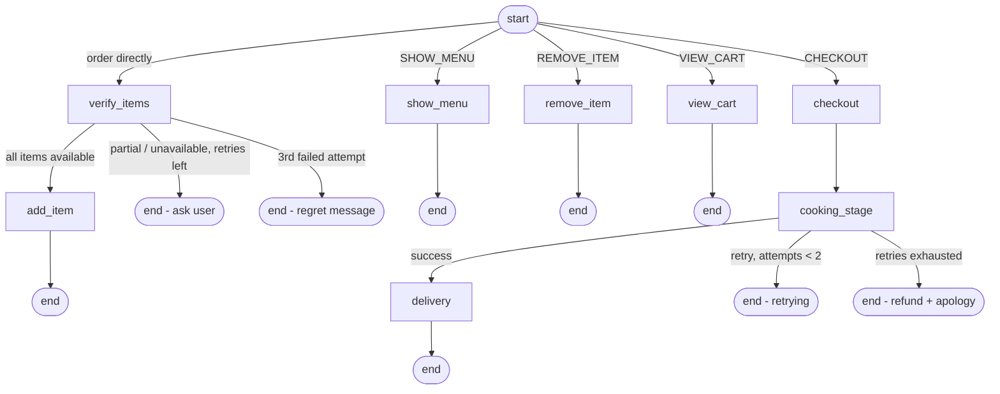

# restaurant-order-agent

A LangGraph-based restaurant ordering agent, exposed as a FastAPI service.

## Demo


*Screenshot of the browser chat UI (`static/index.html`) mid-conversation — showing the menu, cart, and status bar.*

> Drop a screenshot of the running UI at the repo root as `demo.png` for it to render above. See [Run](#run) for how to start the app and grab one.

## Structure

- `agent.py` — the LangGraph agent: intent routing, item verification, cart, checkout, cooking, delivery. Core logic only, no HTTP.
- `service.py` — thin FastAPI service layer that wraps `agent.py` and exposes it over HTTP as a single stateful `/chat` endpoint.
- `helpers/constants.py` — static data (currently the `MENU`).
- `helpers/llm.py` — LLM client setup/connectivity (the `ChatGroq` instance), imported by `agent.py`.
- `helpers/models.py` — all Pydantic/data models (`RequestedItem`, `RequestedItems`, `Cart`, `Order`, `State`, `Status`), imported by `agent.py`.
- `static/index.html` — a minimal browser chat UI for `/chat` (plain HTML/JS, no build step).
- `demo.png` — screenshot of the UI, shown at the top of this README (not committed by default — add your own).
- `.env.example` — copy to `.env` and fill in your `GROQ_API_KEY`.

## Setup

```bash
python3 -m venv .venv
source .venv/bin/activate
pip install -r requirements.txt
cp .env.example .env   # then edit .env with your real GROQ_API_KEY
```

## Run

```bash
uvicorn service:app --reload
```

Service runs at http://localhost:8000:

- **http://localhost:8000/** — browser chat UI (fastest way to try the agent)
- **http://localhost:8000/docs** — interactive API docs (Swagger)

## Conversation flow

The customer can either browse the menu first or order directly — both paths converge on the same verification step before anything is added to the cart.



Key rules baked into the graph:

- **Verification, not blind add**: an order-style message always goes through `verify_items` first. Items are only added to the cart once stock is confirmed.
- **3-strike limit**: `query_count` tracks failed verification attempts. On the 3rd unresolved attempt the agent sends a regret message and stops (`status = "regretted"`).
- **Cart merge, not replace**: `add_item` sums quantities into an existing cart line for the same item instead of overwriting it.
- **Cooking retries**: `cooking_stage` simulates kitchen failures, retries up to 2 times (`cook_retry_count`), and if still failing apologizes and flags a refund instead of retrying forever.
- **Stateful turns, server-side**: the graph is not one-shot. `status`, `query_count`, `cook_retry_count`, `cart`, and `order` all live in an in-memory session on the server, keyed by `session_id`. The client never sees or sends these — it only ever sends a `message` (and the `session_id` after the first call).

## Endpoints

- `GET /` — chat UI (`static/index.html`)
- `GET /menu` — list menu items
- `POST /chat` — send a message. Omit `session_id` on the first call:

  ```json
  {
    "message": "show me the menu"
  }
  ```

  The response includes a `session_id` — pass it back on every following call so the agent resumes where the customer left off:

  ```json
  {
    "message": "I want 2 pizzas",
    "session_id": "4522e886-...-..."
  }
  ```

  Response shape: `session_id`, `reply`, `status`, `cart`, `order`, `cooking_duration` (set once cooking has started). An unrecognized `session_id` returns `404`.

## Roadmap

- Payment integration (not yet implemented)
- Persistent storage (currently in-memory; sessions reset on server restart and won't scale across multiple server processes)
